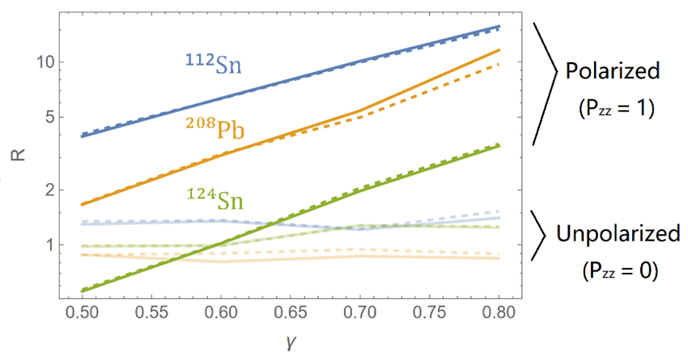
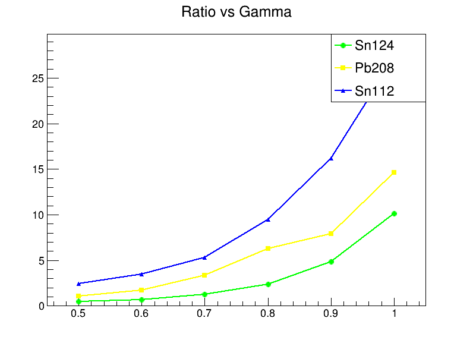
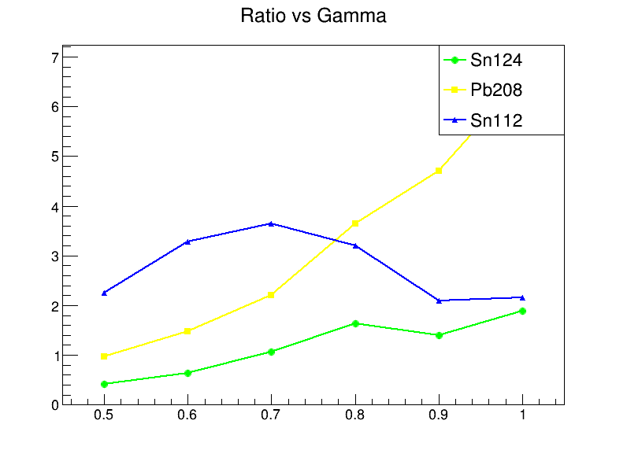
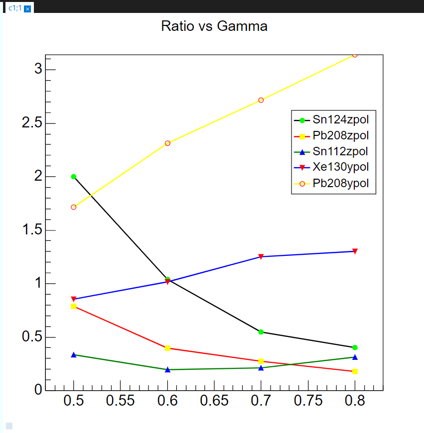

## 博源的cut

## cut原因

由于氘核自发裂解。

z方向取向的只有几乎只有z方向背对背出射。

（侧面反映了，其实ImQMD的计算里初始值几乎不会有偏离z方向的取向的。ImQMD高斯波包的弥散程度远比我们想象的小。）

### z张量极化的图

### y张量极化的图

### cut条件

| cut条件原因       | zpol       | ypol |
|------------|----------------|----------|
| 选择b较大的， （力的冲量较小，横向动量改变小）  | $p^p_x+p^n_x < 200 \mathrm{MeV}$     |$p^p_x+p^n_x < 200 \mathrm{MeV}$  |
|   去除背对背发射的,选择正常的物理事件  |  $p^p_{z'} - p^n_{z'} \in (-150,150) \mathrm{MeV}$     | $p^p_{y'} - p^n_{y'} \in (-150,150) \mathrm{MeV}$ |
| |  $p^p_{z'} + p^n_{z'} \in (1150,\infty) \mathrm{MeV}$    | |

## show

ImQMD 原始数据 未按照b选择 $N \propto b$

上图按照了b选择。

## 加入ypol

phi_fixed 下图 Sn124 ypol的

加入找旋转平面

